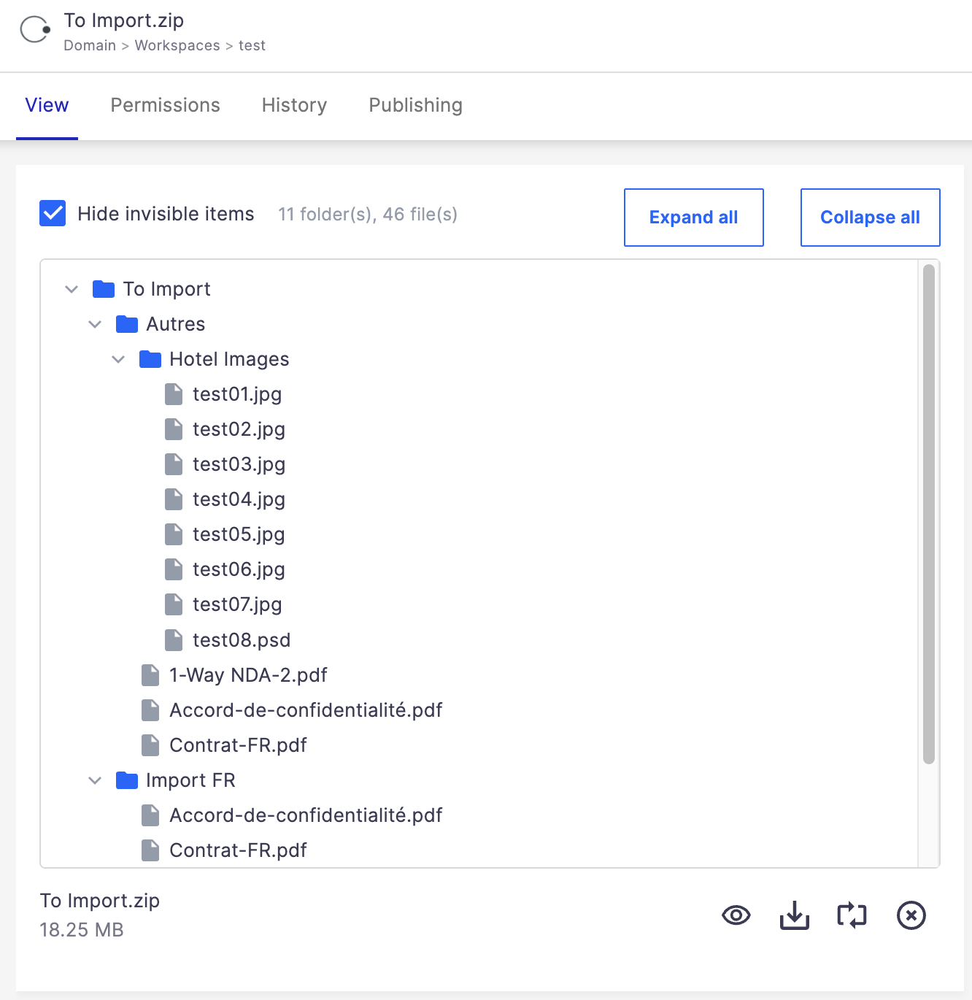

# nuxeo-zip-utils

Utilities for dealing with archives (zip, tar, rar, etc.) and displaying the content of a .zip in Nuxeo.

## Description

### Automation operations:

* **Zip-only** (`ZipUtils.*`): test if a blob is a zip (`IsZip`), list entries (`EntriesList`, `EntriesListReturn`), get entry metadata (`EntryInfo`, `ZipInfo`), extract a single file (`GetFile`), import a zip as a Document tree (`UnzipToDocumentsOp`), zip a Folderish recursively (`ZipFolderishOp`).
* **Generic archive** (`Archive.*`, via Apache Commons Compress — zip, tar, 7z, ar, jar, plus gz/bz2/xz/zstd/lz4/...): detect format and outer compression (`DetectType`), get a single entry's content (`GetEntry`).

### Web UI element:

* **`<nuxeo-zip-utils-display>`**: collapsible tree view of a zip blob's contents, with optional hiding of OS-junk entries (`__MACOSX`, `Thumbs.db`, etc.) and user-defined names. Displays `file:content` by default, but can display any blob holding a zip.




## Operations


### Files > `ZipUtils.IsZip`

* Input is `Document` or `Blob`
* Parameter: `xpath` ("file:content" by default)
* Return the input unchanged
* Set the `zipInfo_isZip` Context Variable to `true` or `false`

JS Example:

```
// In this example, input is a Document. The operation
// tests if file:content is a zip file
function run(input, params) {
  . . .
  ZipUtils.IsZip(input, {});
  // Valuer is returned as a boolean in the "zipInfo_isZip" Context variable:
  if(ctx.zipInfo_isZip) {
    . . .
  }
  . . .
}
```

### Files > `ZipUtils.EntriesList`

* Input is `Document` or `Blob`
* Parameter: `xpath` ("file:content" by default)
* Return the input unchanged
* Set the `zipInfo_entriesList` String Context Variable to the full list of all entries (one/line)


### Files > `ZipUtils.EntryInfo`

* Input is `Document` or `Blob`
* Parameters: `xpath` ("file:content" by default) and `entryName` (exact full path in the zip)
* Return the input unchanged
* Set several context int/long variables: `zipInfo_compressedSize`, `zipInfo_originalSize`, `zipInfo_crc`, and `zipInfo_method` (0 = stored, 8 =  compressed)


### Files > `ZipUtils.GetFile`
* Input is `Document` or `Blob`
* Parameters: `xpath` ("file:content" by default) and `entryName` (exact full path in the zip)
* Returns the corresponding file. Return null if the entry does not exist or is a folder


### Files > `ZipUtils.UnzipToDocumentsOp`

* Input is `Document` or `Blob`
* Extracts an archive and imports the files as Documents, creating the same structure.
* _Note that in all cases the operation creates a root Document at the `target`, it doesn't unzip to the target._
* When `input` is a Blob, the `target` parameter is required. When `input` is a Document the `target` is the parent of `input`.
* The `name` and `title` of the root document is the name of the archive file or the name of the root folder in the archive, by default. You can specify your own name with the `mainFolderishName` parameter.
* With regards to `mapRoot`: sometimes a zip file contains a single root folder and, thus, you want the root Document to be this folder - use `mapRoot = true` in this case. Other times the root Document is just a container to contain all the extracted content - use `mapRoot = false` in this case.
* Parameters:
  * `xpath` (optional): if `input` is a Document, this is the field that contains the archive
  * `target` (required if input is a blob): The parent Document where the import root is created
  * `folderishType` (optional): Type to use when creating Folderish children, default is `Folder`
  * `commitModulo` (optional): Save and commit transaction regularly incrementally (strongly recommended to avoid transaction timeout when you know the zip contains a lot of files), default `100`
  * `mainFolderishType` (optional): Type of the root Document, default is `Folder`
  * `mainFolderishName` (optional): The name for this main container
  * `mapRoot` (optional): Map the root folder of the archive to the root Document, or not. Default `false`.
* Returns the created root Folderish Document.


### Files > `ZipUtils.ZipFolderishOp`

* Input is a Folderish document
* Zip all the content recursively, with the hierarchy. Ignore non-folderish documents that have no blobs
* Returns the Zipped content
* Parameters:
  * `callbackChain` (optional): Byt default, the blob is read in "file:content". Use a callback chain to tune this behavior. Your chain _must_  receive `Document` as input and must output a Blob (even if null)
  * `whereClauseOverride`: To find the children of folderish documents, the operation exludes by default the children that are HiddenInNavigation, version, proxy, or in the trash. You can define your own filter. WARNING: do not start it with "AND", the code prefixes it for you.
    The default is `ecm:mixinType != 'HiddenInNavigation' AND ecm:isVersion = 0 AND ecm:isProxy = 0 AND ecm:isTrashed = 0`
  * `doNotCreateMainFolder` (optionl): When `true` the zip archive TOC will not start with the name of the main folder.


### Files > `ZipUtils.ZipInfo`

* Input is `Document` or `Blob`
* Returns the input unchanged
* Parameter: `xpath`, optional ("file:content" by default)
* Return info about the zip in Context Variables: `zipInfo_comment`, `zipInfo_countFiles` (int), `zipInfo_countDirectories` (int)


### Files > `Archive.DetectType`

* Input is `Document` or `Blob`
* Detects the archive format (and outer compression, if any) of generic archives via Apache Commons Compress (zip, tar, 7z, ar, arj, cpio, dump, jar, plus compressors gz/bz2/xz/zstd/lz4/…)
* Parameters:
  * `xpath` (optional): if input is a Document, this is the field that contains the archive (default `file:content`)
  * `updateMimeType` (optional, default `false`): when `true` and input is a Document, adds the `archive` facet and stores the detected types in `archive:encoding` (compressor) and `archive:type` (archive). _Note: requires the `archive` facet/schema to be registered — see `OSGI-INF/CoreExtensions.xml`, currently disabled._
  * `save` (optional, default `false`): save the document after `updateMimeType`
* Sets context variables `archive_type` (e.g. `zip`, `tar`, `7z`) and `compress_type` (e.g. `gzip`, `xz`, `zstd`); either may be absent
* When input is a Blob, returns the same blob with its mime type updated (if recognized); when input is a Document, returns the document


### Files > `Archive.GetEntry`

* Input is `Document` or `Blob`
* Generic-archive equivalent of `ZipUtils.GetFile`: returns the entry's content as a Blob, for any format Apache Commons Compress can read (tar, 7z, etc.) — not just zip
* Parameters: `xpath` ("file:content" by default) and `entryName` (required, exact full path inside the archive)
* Returns the corresponding Blob, or `null` if the entry does not exist or is a folder


## Web UI Element

### `<nuxeo-zip-utils-display>`

Polymer element that displays the content of a zip blob as a hierarchical, collapsible tree. Reads the entries via the `ZipUtils.EntriesListReturn` operation.

When the tree is shown, a standard `<nuxeo-document-blob>` is rendered below it, giving the user the file name, size, and the usual blob actions (download, replace, clear). Visibility of the replace/clear actions follows the standard Web UI rules (write permission, immutability, retention).

To let blob mutations (replace/clear) propagate back to the caller, **use two-way binding on `document`** (`{{document}}`, not `[[document]]`). When the blob changes, the element re-evaluates the mime-type guardrail and refreshes (1 server call if the new blob is still a zip).

The element relies on the parent layout to keep `document.properties` up to date. It inspects the blob's `mime-type` locally before calling the server:
* If `mime-type === "application/zip"` → fetches the entries and displays the tree (1 server call).
* If the blob is missing → displays "No archive found at the given path." (no server call).
* If the blob has any other `mime-type` → displays "Not a zip archive." (no server call).

It is the developer's responsibility to mount the element only where it makes sense. A common pattern is to wrap it in a `dom-if` and fall back to another viewer when the document does not carry a zip:

```html
<!-- Adapt the path if needed. Here we assume we are in a document layout -->
<link rel="import" href="../../nuxeo-zip-utils/nuxeo-zip-utils-display.html">
. . . dom-module, style, ...
<template is="dom-if" if="[[_looksLikeZip(document)]]">
  <nuxeo-zip-utils-display role="widget" document="{{document}}" hide-invisible></nuxeo-zip-utils-display>
</template>
<template is="dom-if" if="[[!_looksLikeZip(document)]]">
  <nuxeo-document-viewer role="widget" document="[[document]]"></nuxeo-document-viewer>
</template>
. . .
```

The most common use case is when you display the main blob (at `file:content`), but the element supports any blob (see below the `xpath` and `blob-index` attributes).

`_looksLikeZip` is up to you to implement on the parent layout — its shape depends on which blob you target. A few examples:

Main blob at `file:content`:

```javascript
_looksLikeZip(doc) {
  return doc
      && doc.properties
      && doc.properties['file:content']
      && doc.properties['file:content']['mime-type'] === 'application/zip';
}
```

2nd blob in `files:files` (legacy schema — list items wrap the blob in a `file` field):

```javascript
_looksLikeZip(doc) {
  if (doc && doc.properties && doc.properties['files:files'] && doc.properties['files:files'][1]) {
    return doc.properties['files:files'][1].file
        && doc.properties['files:files'][1].file['mime-type'] === 'application/zip';
  }
  return false;
}
```

3rd blob in a custom blob-list field at `morefiles:blobs` (modern schema — list items are blobs directly):

```javascript
_looksLikeZip(doc) {
  if (doc && doc.properties && doc.properties['morefiles:blobs'] && doc.properties['morefiles:blobs'][2]) {
    return doc.properties['morefiles:blobs'][2]['mime-type'] === 'application/zip';
  }
  return false;
}
```

Attributes:
* `document` (required, two-way recommended — `{{document}}`): the document whose blob will be inspected. Two-way binding is required for blob replace/clear to propagate up.
* `xpath` (optional, default `file:content`): property path of the blob (or list of blobs)
* `blob-index` (optional, default `0`): 0-based index when `xpath` resolves to a list of blobs (e.g. `files:files`); ignored for single-blob properties
* `hide-invisible` (optional): when present, hides entries whose basename starts with `.` and entries matching the built-in OS-junk list. Per Polymer convention, just having the attribute means `true` (even `hide-invisible="false"` is `true`); omit the attribute for `false`.
* `extra-hidden-names` (optional): comma-separated list of additional path-segment names to hide when `hide-invisible` is set. Matched case-insensitively, exact match against any segment of the entry path. Added on top of the built-in list.
* `hide-blob-actions` (optional): when present, hides the embedded `<nuxeo-document-blob>` row (download / replace / clear actions) and shows only the file name and size in the same visual style. Per Polymer convention, just having the attribute means `true`; omit for `false`. With this attribute, one-way binding `[[document]]` is fine since there are no actions to propagate back.

Built-in hidden names (when `hide-invisible` is set):
* Anything starting with `.` (covers Mac `.DS_Store`, `.Spotlight-V100`, `.Trashes`, `.fseventsd`, `.AppleDouble`, AppleDouble forks `._*`, etc.)
* `__MACOSX` (Mac resource-fork sidecar folder)
* `Thumbs.db`, `ehthumbs.db`, `ehthumbs_vista.db` (Windows thumbnail caches)
* `Desktop.ini` (Windows folder metadata)
* `$RECYCLE.BIN`, `System Volume Information` (Windows, when zipping a drive root)
* `Icon\r` (Mac custom folder icon file)

Examples:

```html
<!-- Default: blob at file:content (two-way binding for blob actions) -->
<nuxeo-zip-utils-display document="{{document}}"></nuxeo-zip-utils-display>

<!-- Custom xpath, hide OS junk -->
<nuxeo-zip-utils-display document="{{document}}"
    xpath="blah:blih" hide-invisible></nuxeo-zip-utils-display>

<!-- List of blobs (e.g. files:files), pick the 4th (index 3) -->
<nuxeo-zip-utils-display document="{{document}}"
    xpath="files:files" blob-index="3"></nuxeo-zip-utils-display>

<!-- Hide built-in junk plus a few extra names -->
<nuxeo-zip-utils-display document="{{document}}" hide-invisible
    extra-hidden-names="readme.txt,_metadata"></nuxeo-zip-utils-display>

<!-- Tree + name/size only, no blob actions -->
<nuxeo-zip-utils-display document="[[document]]" hide-blob-actions></nuxeo-zip-utils-display>


## Deploy / Build and Deploy

### Build and Deploy Locally

```bash
git clone https://github.com/nuxeo-sandbox/nuxeo-zip-utils
cd nuxeo-zip-utils
mvn clean install
```

To skip unit testing, add `-DskipTests`.

The Marketplace package is generated at:
```
nuxeo-zip-utils-package/target/nuxeo-zip-utils-package-{VERSION}}-*.zip
```

Install it via `nuxeoctl`:
```bash
nuxeoctl mp-install nuxeo-zip-utils-package-{VERSION}.zip
```

### Deploy from Nuxeo Marketplace

This plugin is available as a package on the [Nuxeo Marketplace](https://connect.nuxeo.com/nuxeo/site/marketplace/package/nuxeo-zip-utils), you can just:

```bash
nuxeoctl mp-install nuxeo-zip-utils
```


## Support

**These features are not part of the Nuxeo Production platform.**

These solutions are provided for inspiration and we encourage customers to use them as code samples and learning resources.

This is a moving project (no API maintenance, no deprecation process, etc.) If any of these solutions are found to be useful for the Nuxeo Platform in general, they will be integrated directly into the platform, not maintained here.

## License

[Apache License, Version 2.0](http://www.apache.org/licenses/LICENSE-2.0.html)

## About Nuxeo

Nuxeo Platform is an open source highly scalable, cloud-native, enterprise content management product with rich multimedia support, written in Java. Data can be stored in both SQL & NoSQL databases.

The development of the Nuxeo Platform is mostly done by Nuxeo employees with an open development model.

The source code, documentation, roadmap, issue tracker, testing, benchmarks are all public.

More information is available at [Hyland/Nuxeo](https://www.hyland.com/en/solutions/products/nuxeo-platform).
